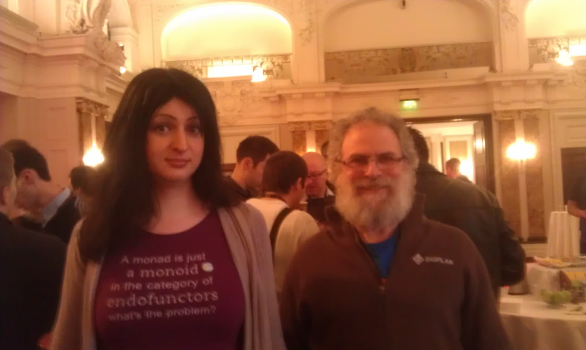

# Monoids in the category of endofunctors


### Kaare Nilsen

----


----
## Definition functional programming?

<aside class="notes">
    Før vi starter med programmet for i dag.. La meg forsøke å definere hva jeg mener med funksjonell
    programmering:
    <p>
        We construct our programs using only pure functions. In other words, functions that have no side
        effects. What does this mean exactly? Performing any of the following actions directly would
        involve a side effect:
    </p>

    <p>
        Reassigning a variable
Modifying a data structure in place
Setting a field on an
        object
Throwing
        an exception or halting with an error Printing to the console or reading user input Reading from
        or writing to a file
Drawing on the screen
    </p>
</aside>

----
## Pure function

### f(x)

<aside class="notes">
    <p>
        A function with input type A and output type B (written in Scala as a single type: A => B) is a
        computation which relates every value a of type A to exactly one value b of type B such that b is
        determined solely by the value of a.
    </p>

    <p>
        For example, a function intToString having type Int => String will take every integer to a
        corresponding
        string. Furthermore, if it really is a function, it will do nothing else.
    </p>

    <p>
        In other words, a function has no observable effect on the execution of the program other than to
        compute a result given its inputs; we say that it has no side effects. We sometimes qualify such
        functions as pure functions to make this more explicit. You already know about pure functions.
        Consider
        the addition (+) function on integers. It takes two integer values and returns an integer value. For
        any
        two given integer values it will always return the same integer value. Another example is the length
        function of a String in Java, Scala, and many other languages. For any given string, the same length
        is
        always returned and nothing else occurs.
    </p>

    <p>
        We can formalize this idea of pure functions by using the concept of referential transparency (RT).
        This
        is a property of expressions in general and not just
        functions. For the purposes of our discussion, consider an expression to be any part of a program
        that
        can be evaluated to a result, i.e. anything that you could type into the Scala interpreter and get
        an
        answer. For example, 2 + 3 is an expression that applies the pure function + to the values 2 and 3
        (which are also expressions). This has no side effect. The evaluation of this expression results in
        the
        same value 5 every time. In fact, if you saw 2 + 3 in a program you could simply replace it with the
        value 5 and it would not change a thing about your program.
        This is all it means for an expression to be referentially transparent—in any program, the
        expression
        can be replaced by its result without changing the meaning of the program. And we say that a
        function is
        pure if its body is RT, assuming RT inputs.
    </p>

    <p>
		En funksjon er ikke pure om den endrer tilstand (global tilstand)
	</p>

</aside>

----
## Referential Transparency

<aside class="notes">

    <p>We can formalize this idea of pure functions by using the concept of referential transparency (RT).
        This
        is a property of expressions in general and not just functions. For the purposes of our discussion,
        consider an expression to be any part of a program that can be evaluated to a result, i.e. anything
        that
        you could type into the Scala interpreter and get an answer. For example, 2 + 3 is an expression
        that
        applies the pure function + to the values 2 and 3 (which are also expressions). This has no side
        effect.
        The evaluation of this expression results in the same value 5 every time. In fact, if you saw 2 + 3
        in a
        program you could simply replace it with the value 5 and it would not change a thing about your
        program.
        This is all it means for an expression to be referentially transparent—in any program, the
        expression
        can be replaced by its result without changing the meaning of the program. And we say that a
        function is
        pure if its body is RT, assuming RT inputs.
    </p>

    <p>
        SIDEBAR
        Referential transparency and purity
        An expression e is referentially transparent if for all programs p, all occurrences of e in p can be
        replaced by the result of evaluating e, without affecting the observable behavior of p. A function f
        is
        pure if the expression f(x) is referentially transparent for all referentially transparent x.1
    </p>
</aside>

----


<aside class="notes">
    <p>
        In computer science, a programming language is said to have first-class functions if it treats
        functions
        as first-class citizens. Specifically, this means the language supports passing functions as
        arguments
        to other functions, returning them as the values from other functions, and assigning them to
        variables
        or storing them in data structures.[1] Some programming language theorists require support for
        anonymous
        functions as well.[2]
    </p>

</aside>

---
<section>
    <iframe height="900" width="900" src="http://localhost:1338"></iframe>
</section>

<aside class="notes">
	<pre>
	import collection.mutable

	case class Person(name: String, age: Int, postCode: String)

	object HigherOrder extends App {
	  val kaare = Person("Kaare", 29, "0770")
	  val kjell = Person("Kjell", 30, "0770")
	  val anne = Person("Anne", 17, "0770")

	  val people = kaare :: kjell :: anne :: Nil


	  val myndigePersoner: Person => Boolean = _.age >= 18
	  val ropende: (Person) => String = _.name.toUpperCase


	  def foreach(ps: Seq[Person])(f: Person => Unit): Unit = {
	    for (p <- ps) yield {
	      f(p)
	    }
	  }

	   foreach(people){ p =>
	     println(p)
	   }

	  val eachPerson = foreach(people) _

	  eachPerson(println)

	  val myndige = people.filter(myndigePersoner).map(ropende)

	  println(myndigePersoner(anne))

	}
	</pre>
	
</aside>

----
## Monomorphic functions

<aside class="notes">
  Funksjoner som bare kan operere på argumenter av en gitt type..
  def numWriter(a:Int){println(a)}
</aside>

---
<section>
	<iframe height="900" width="900" src="http://localhost:1338"></iframe>
</section>


<aside class="notes">
  Funksjoner som bare kan operere på argumenter av en gitt type..
  def numWriter(a:Int){println(a)}
</aside>


----
## Polymorphic functions

<aside class="notes">
  Funksjoner som kan benyttes på en flere typer
  <p>
    def writer[A](a:A){println(a)}
  </p>

  <p>
	def numWriter[A:Numeric](a:A){println(a)}
  </p>
</aside>

---
<section>
	<iframe height="900" width="900" src="http://localhost:1338"></iframe>
</section>

<aside class="notes">
  Funksjoner som kan benyttes på en flere typer
  <p>
    def writer[A](a:A){println(a)}
  </p>

  <p>
	def numWriter[A:Numeric](a:A){println(a)}
  </p>
</aside>


----
## Endofunction

### A => A

<aside class="notes">
	Funksjon som returnerer samme type som den tar inn.. eksempel
</aside>

---
<section>
	<iframe height="900" width="900" src="http://localhost:1338"></iframe>
</section>

<aside class="notes">
	def inc(i:Int):Int = i + 1
</aside>	

----        
## Currying

### (A,B)=>C

### A => B => C

<aside class="notes">
    <p>Ta case class Person(name:String, age:Int) i repl</p>

    <p>så en (Person(_,_))</p>

    <p>så en (Person(_,_)).curried</p>

    <p>
        Every function that takes more than one argument has a kind of normal form, called its curried form.
        Instead of a function taking a single tuple of n arguments, a curried function is a chain of n functions that 
        take one argument each. For example, a function of a type like (A,B) => C can be transformed into a function
        of type A => (B => C). The resulting (curried) function takes the first argument of type A and then returns
        another function that receives the second argument of type B. The arrow (=>) in function types actually
        associates to the right, so the parentheses in this case are superfluous. You may often see a type like this
        written A => B => C.
        Footnote 2mThis is named after the mathematician Haskell Curry, who discovered the principle. It was
        independently discovered earlier by Moses Schoenfinkel, but "Schoenfinkelization" didn't catch on.
    </p>
</aside>
---
<iframe height="900" width="900" src="http://localhost:1338"></iframe>

<aside class="notes">
    <p>Ta case class Person(name:String, age:Int) i repl</p>

    <p>så en (Person(_,_))</p>

    <p>så en (Person(_,_)).curried</p>

    <p>
        Every function that takes more than one argument has a kind of normal form, called its curried form.
        Instead of a function taking a single tuple of n arguments, a curried function is a chain of n functions that 
        take one argument each. For example, a function of a type like (A,B) => C can be transformed into a function
        of type A => (B => C). The resulting (curried) function takes the first argument of type A and then returns
        another function that receives the second argument of type B. The arrow (=>) in function types actually
        associates to the right, so the parentheses in this case are superfluous. You may often see a type like this
        written A => B => C.
        Footnote 2mThis is named after the mathematician Haskell Curry, who discovered the principle. It was
        independently discovered earlier by Moses Schoenfinkel, but "Schoenfinkelization" didn't catch on.
    </p>
</aside>

----
## Partial application

<aside class="notes">
    <p>
        scala> val timesTwo: Int => Int = (_ * 2)
    </p>

     <p>
        Partial application is straightforward. It's simply the act of passing a function some of its arguments
        and leaving the rest unspecified. The result is a function that takes the rest of the arguments. For
        example:
     </p>

    <p>
        Here we have partially applied the * function by passing 2 as one of its arguments. The result is a
        function that multiplies its argument by 2.
    </p>

</aside>

---
<iframe height="900" width="900" src="http://localhost:1338"></iframe>

<aside class="notes">
	<p>
		val timesTwo: Int => Int = (_ * 2)
	</p>
</aside>
   
----
## Partial function

<aside class="notes">
    <p>
        Dette ligna jo i ord iaff. Men ikke i betydning
    </p>
    <p>
        A function works for every argument of the defined type. In other words, a function defined as (Int) =>
        String takes any Int and returns a String.
    </p>
    <p>
        A Partial Function is only defined for certain values of the defined type. A Partial Function (Int) =>
        String might not accept every Int.
    </p>
    <p>
        isDefinedAt is a method on PartialFunction that can be used to determine if the PartialFunction will
        accept a given argument.
    </p>
    <p>
        Note PartialFunction is unrelated to a partially applied function that we talked about earlier.
        See Also Effective Scala has opinions about PartialFunction.
        scala> val one: PartialFunction[Int, String] = { case 1 => "one" }
        one: PartialFunction[Int,String] = &lt;function1&gt;
    </p>
    <p>
        scala> one.isDefinedAt(1)
        res0: Boolean = true
    </p>
    <p>
        scala> one.isDefinedAt(2)
        res1: Boolean = false
    </p>
    <p>
        You can apply a partial function.
        scala> one(1)
        res2: String = one
    </p>
    <p>
        PartialFunctions can be composed with something new, called orElse, that reflects whether the
        PartialFunction is defined over the supplied argument.
    </p>
    <p>
        scala> val two: PartialFunction[Int, String] = { case 2 => "two" }
    </p>
    <p>
        scala> val three: PartialFunction[Int, String] = { case 3 => "three" }
    </p>
    <p>
        scala> val wildcard: PartialFunction[Int, String] = { case _ => "something else" }
    </p>
    <p>
        scala> val partial = one orElse two orElse three orElse wildcard
    </p>
    <p>
        scala> partial(5)
    </p>
    <p>
        res24: String = something else
    </p>
    <p>
        scala> partial(3)
    </p>
    <p>
        res25: String = three
    </p>
    <p>
        scala> partial(2)
    </p>
    <p>
        res26: String = two
    </p>
    <p>
        scala> partial(1)
    </p>
    <p>
        res27: String = one
    </p>
    <p>
        scala> partial(0)
    </p>
    <p>
        res28: String = something else
    </p>
</aside>
---
<iframe height="900" width="900" src="http://localhost:1338"></iframe>

<aside class="notes">
    <p>
        Dette ligna jo i ord iaff. Men ikke i betydning
    </p>
    <p>
        A function works for every argument of the defined type. In other words, a function defined as (Int) =>
        String takes any Int and returns a String.
    </p>
    <p>
        A Partial Function is only defined for certain values of the defined type. A Partial Function (Int) =>
        String might not accept every Int.
    </p>
    <p>
        isDefinedAt is a method on PartialFunction that can be used to determine if the PartialFunction will
        accept a given argument.
    </p>
    <p>
        Note PartialFunction is unrelated to a partially applied function that we talked about earlier.
        See Also Effective Scala has opinions about PartialFunction.
        scala> val one: PartialFunction[Int, String] = { case 1 => "one" }
        one: PartialFunction[Int,String] = &lt;function1&gt;
    </p>
    <p>
        scala> one.isDefinedAt(1)
        res0: Boolean = true
    </p>
    <p>
        scala> one.isDefinedAt(2)
        res1: Boolean = false
    </p>
    <p>
        You can apply a partial function.
        scala> one(1)
        res2: String = one
    </p>
    <p>
        PartialFunctions can be composed with something new, called orElse, that reflects whether the
        PartialFunction is defined over the supplied argument.
    </p>
    <p>
        scala> val two: PartialFunction[Int, String] = { case 2 => "two" }
    </p>
    <p>
        scala> val three: PartialFunction[Int, String] = { case 3 => "three" }
    </p>
    <p>
        scala> val wildcard: PartialFunction[Int, String] = { case _ => "something else" }
    </p>
    <p>
        scala> val partial = one orElse two orElse three orElse wildcard
    </p>
    <p>
        scala> partial(5)
    </p>
    <p>
        res24: String = something else
    </p>
    <p>
        scala> partial(3)
    </p>
    <p>
        res25: String = three
    </p>
    <p>
        scala> partial(2)
    </p>
    <p>
        res26: String = two
    </p>
    <p>
        scala> partial(1)
    </p>
    <p>
        res27: String = one
    </p>
    <p>
        scala> partial(0)
    </p>
    <p>
        res28: String = something else
    </p>
</aside>

----
## Function Composition

---
<iframe height="900" width="900" src="http://localhost:1338"></iframe>
<aside class="notes">
	<p>
		Function Composition
		Let’s make two helpful functions:
		val addUmm: (String) => String = {x=> x + " umm"}
		val addAhem: (String) => String = {x=> x + " ahem"}
    </p>
    <p>
		compose
		compose makes a new function that composes other functions f(g(x))
		addAhem(addUmm("Yo"))
		val ummThenAhem = addAhem compose addUmm
    </p>
    <p>
		andThen
		andThen is like compose, but calls the first function and then the second, g(f(x))
		addUmm(addAhem("Yo"))
		val ummThenAhem = addAhem compose addUmm
    </p>
</aside>

----
## Functor

### F[A] => F[B]

<aside class="notes">
	functor is  a container that allows us to apply a function to all of its elements. 
</aside>

---

``` scala
trait Functor[F[_]] {
  def map[A, B](f: A => B, a: F[A]): F[B]
}
```

<aside class="notes">
    This one let’s us map a function over a List, which means that this functor looks like a container that allows us to apply a function to all of its elements.   
    This is a very intuitive way to think about functors.	
</aside>	

----
## Applicative Functor

---

``` scala
trait Applicative[F[_]] extends Functor[F] {
  def apMap[A, B](f: F[A => B], a: F[A]): F[B]
  def point[A](a: A): F[A]
  override final def map[A, B](f: A => B, a: F[A]) = apMap(point(f), a)
}
```

----
## Semigroup

<aside class="notes">
	Semigroup er en monoid uten zero
</aside>	

---
## Semigroup

### binary associative operation

<aside class="notes">
	if we combine three strings by saying (r + s + t), the operation is associative —it doesn't matter whether we parenthesize it ((r + s) + t) or (r + (s + t)).
</aside>	

---

``` scala
trait SemiGroup[A] {
  def append(a1: A, a2: A): A
}
```

----
## Monoid

### (er også en semigroup :))

<aside class="notes">
	<p>
		Just what is a monoid, then? It is simply an implementation of an interface governed by some laws. Stated tersely, a monoid is a type together with an associative binary operation (op) which has an identity element (zero).
	</p>
	<p>
		Først og fremst se på dette som et pattern. en navngitt abstraksjon om du vil
	</p>		
</aside>

---
## Monoid

### Identity (zero)

<aside class="notes">
	Let's consider the algebra of string concatenation. We can add "foo" + "bar" to get "foobar", and the empty string is an identity element for that operation. That is, if we say (s + "") or ("" + s), the result is always s.
</aside>	

---

``` scala
trait Monoid[A] {
  def append(a1: A, a2: A): A
  def zero: A
}
```

----
## Monad

### (er også en Monoid :))

<aside class="notes">
	Design pattern that allows us to create pipelines of composed functions
	Monad er en generell container for datastrukturerer. Den har  pluss (kombinator),  og en unit (zero)
</aside>

---

## THE THREE MONAD LAWS	

1. A monad may not injure a human being or, through inaction, allow a human being to come to harm.
2. A monad must obey the orders given to it by human beings, except where such orders would conflict with the First Law.
3. A monad must protect its own existence as long as such protection does not conflict with the First or Second Laws.

<aside class="notes">
	err.. nei det var ikke monad lovene.....
</aside>	

---
## Warm Fuzzy Thing


<aside class="notes">
	our biggest mistake [in designing Haskell was u]sing the scary term "monad" rather than "warm fuzzy thing". :)
	Simon PJ,
</aside>	

---

``` scala
trait Monad[F[_]] extends Applicative[F] {
  def flatMap[A, B](f: A => F[B], a: F[A]): F[B]  
}
```

<aside class="notes">
	<p>Til forskjell fra applicative functor så er rekkefølgen av sekvenseringen av komposisjonen i en monad definert</p>
	<p>Alt dette handler om composition. SÅ disse begrepene er her egentlig bare for å gjøre ting som i utgangspuntet ikke er composable composable</p>

</aside>	